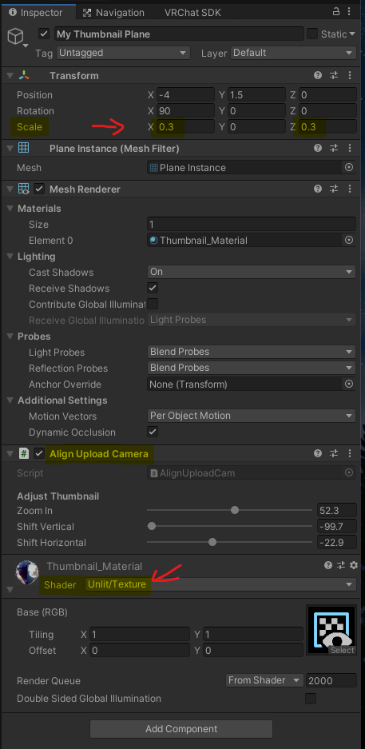
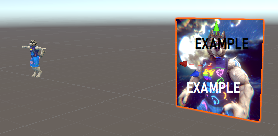
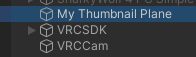
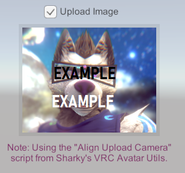
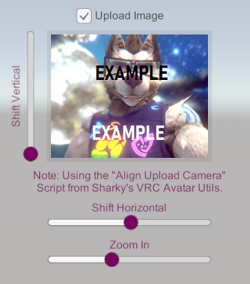

# Using a Picture as Thumbnail during Upload

## Summary

 1. Create a picture you want to use (e.g. VRC Photo, using an image editor, a drawing, ...)
 2. Add this to your Unity project
 3. Add a simple Plane to your scene
 4. Drag the imported picture (imported as texture) onto the plane
 5. Set the plane shader to *Unlit* and resize the plane to fit the image aspect ratio
 6. Place the plane somewhere in the Scene a bit away from your avatar
 7. Add the *Align Upload Camera* component to your plane object
 8. Start the Build as usual and choose to Upload a new image.
    The Thumbnail Camera (*VRCCam*) should now align to your picture
 9. Select the plane object in the Hierarchy panel and find the sliders in the Inspector panel to adjust the thumbnail

VRChat Thumbnails are 4:3 aspect ratio. 
You should prepare your thumbnail accordingly and also scale the plane to a 4:3 ratio (e.g. 0.4 by 0.3 world units).
You can also use a square image (1:1 aspect) but then should also keep the plane squared.

The *Align Upload Camera* component will fit the camera to be fully covered by the image, 
i.e. it will cut out the edges of the image to get the 4:3 thumbnail.

## Detailed Workflow

First you need a picture. This can be a photo you snap while in VRChat, something you created in an image editor,
a drawing, whatever you like. Make sure it has a decent resolution (ideally more than 256 by 192 pixels).
It should have an aspect ratio (width divided by height) equal to 4:3 if you want to use it as is.
It can have any other aspect though, e.g. square. You will later be able to select which part to use since this
tool will cut a 4:3 aspect portion out of your picture.

Add the picture file (I suggest using a png file, 24 Bit RGB color) to your Unity project by dragging it into your
Assets. Probably give it a sensible name.

In your avatar scene, add a new Plane object by using the upper menu bar: `GameObject > 3D Object > Plane`.
It will be appended to your hierarchy root level at the bottom. You can rename this to e.g. "My Thumbnail Plane".

From your Assets, drag the imported picture (which is imported as a texture) onto the new plane object.
This will automatically create a material for the plane and assign it.

*Refer to the following image of the Inspector panel for the next steps*

Change the Shader used by the created material to `Unlit/Texture`. Otherwise the colors will be altered by
lighting and stuff in your scene.

Optionally rotate the picture plane upright by setting Rotation X to 90.
The picture plane needs to be Scaled in the same aspect ratio as your image.
Set Scale X (for width) and Scale Z (for height) to a ratio that fits your image's aspect ratio.
The Y Scale can be 0 or 1 it does not really matter since the plane is flat.

Scale Examples:
- For a square image, Scale X and Z are equal, e.g. both 0.3.
- For a 4:3 image, choose e.g. Scale X to 0.4 and Scale Z to 0.3.

Now move the plane out of the way of your avatar. It must not intersect with any visible objects in your scene.
There should also be no objects in front of the Plane (since the Camera will be moved here during upload).
Moving can be done by dragging the gizmo in the scene view or by typing a Position in the inspector.
Here is an example of where I placed it (Position X, Y, Z used are -4, 1.5, 0):

Now, in order to make use of my actual tool, we need to add it:
Click the "Add Component" button (or use the Menu bar's "Component") to add the
`Sharky's VRC Avatar Utils > Align Upload Camera` script component. 

You are now ready to use this during your Build & Publish process. 
Start it as you normally do. After some time, the Upload user interface will show.
As usual, for new avatars, the Upload Image checkbox will be set or you need to set it if you want
to change it when uploading to an existing blueprint id. 

Optionally, to fine tune your picture or to select a 4:3 area from the image, you can use the sliders
in the *Align Upload Camera* component. To see them, select your Plane object in the Hierarchy panel:

Move this around until you are satisfied and complete the upload as usual.
In my example, I zoomed in a bit and shifted the image so my face fills up the thumbnail image:

One final advice: The Sliders will be reset when the upload is complete or you cancel it
(by pressing the play button). Remember your settings or take a screenshot and then set the sliders
to the same values while not being in play mode if you would like to have them saved for next time.

*New:* For convenience, a feature has been added to show the sliders in the Upload user interface.
They are connected to the Component's sliders described above:

